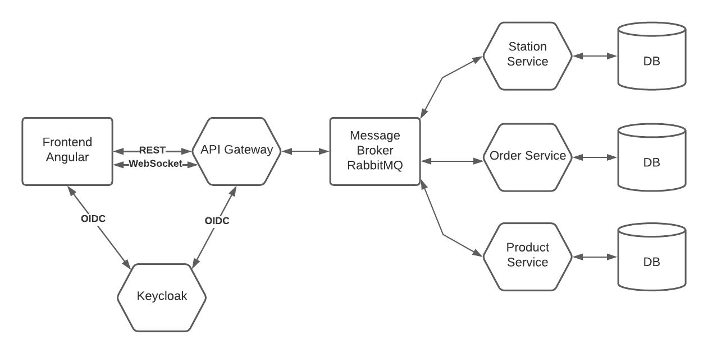
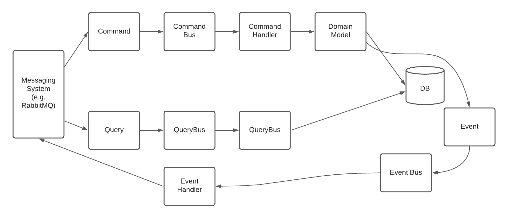

# Order-System

This repository consists of a software system which enables to perform order-management for private or fundraiser
catering/festival events.

## Architecture

The system is based on an event driven architecture with several backend microservices, a fronted, auxiliary services
for local testing, gradle modules for cross-service DTO and a CQRS library.



### Backend

The backend runs with four microservices, each specific for a domain of the system:

- Product Service: Focused on product management (CRUD)
- Order Service: Handles orders, which consist of several product items
- Station Service: Performs all actions regarding the processing of orders (kitchen -> food ready, bar -> drinks ready)
- API Gateway: Provides a REST API for frontend client and routes messages to the relevant micro services

### Frontend

The frontend is built with Angular and is based on five modules:

- Core Module: Has all services which are used across the application
- Shared: Consists of UI components for reuse in the application.
- Product: All components for product management.
- Order: All components for order management.
- Station: Station use case components.

The Angular internal routes map to the different modules and are secured with an authentication guard, combined with the
Angular Keycloak implementation. There is also a built-in interceptor for HTTP calls which sets JWT in the authorization
header when communicating with the API-Gateway.

### Auxiliary Services and Database

At the moment, the system is only capable of local development and testing. It needs this auxiliary services, which run
as Docker containers:

- Database: MongoDB, only one instance, but multiple collections, one for each microservice (simplified Database per
  Service pattern)
- Keycloak: Used for authentication and as identity provider. Secures the connection between API-Gateway and Frontend.
  In future development, it should also handle inter service authentication between micro services.
- RabbitMQ: Message Broker for asynchronous, event based inter service communication. Every microservice registers it's
  own exchange on application startup at the message broker, together with routing keys and queue binding.

## Get Started - Run the system

### Prerequisites

You should have Docker and Docker-Compose installed on a local machine. Besides that, a browser of your choice for the
frontend. The application was tested thoroughly with Chrome, but should also work without any major drawbacks in Firefox
or Edge. For a better development experience with hot-reloading of code changes and easier service restart, IntelliJ is
recommended as IDE. However, for local testing a docker-compose setup will spin up all necessary services.

For development, it is also necessary or recommenden to have the following tools installed:

- Gradle CLI
- Node.js (LTS version)
- NPM
- Angular CLI

### Local Development Environment

Open the root folder of the repository with IntelliJ. If IntelliJ doesn't recognize the project structure, try to
import 'via Gradle Module'. If you don't want to develop anything and just want to try it out, skip the next parts and
start with setup for local test environment.

#### Starting the Auxiliary Services

Open a terminal session in the root folder of the repository and run the following commands:

```bash
docker-compose up -d keycloak
docker-compose up -d mongo
docker-compose up -d mongo-express
docker-compose up -d rabbitmq
```

#### Create IntelliJ Run-Configuration

For each microservice:

- api-gateway
- order-service
- product-service
- station-service

... create a Micronaut Run Configuration in IntelliJ. Set the main class of each service
to `at.fhcampuswien.dev.we.ApplicationKt`

Set the following environment variables in the Run-Configuration of each microservice:

- api-gateway: `RABBITMQ_HOST=localhost;KEYCLOAK_HOST=localhost`
- order-service: `RABBITMQ_HOST=localhost;MONGODB_HOST=localhost`
- product-service: `RABBITMQ_HOST=localhost;MONGODB_HOST=localhost`
- station-service: `RABBITMQ_HOST=localhost;MONGODB_HOST=localhost`

Run all the microservice Run-Configurations, check the logs of each service, no service should have any error messages.
If that's not the case, then the auxiliary services didn't start or the run configuration is bad. Check the logs to fix
the issues.

#### Start the frontend:

For development, you can start Angular with the built-in development webserver and hot-reloading. Change to the
directory `./frontend` and execute the following command:

```bash
ng serve
```

You could also create another IntelliJ NPM run configuration to start the frontend via `start` command and pointing to
the package.json file in frontend directory.

The application frontend is now available under `http://localhost:4200`

### Local Test Environment

Start here if you just want to test the application, without interests in developing. Thanks to docker and
docker-compose, this is quite easy.

#### Build all Services

Run in repository root:

```bash
docker-compose build
```

This might take a while. As soon as the build finished successfully, start all the parts of the application with this
command:

```bash
docker-compose up -d
```

Now you are ready to go. Open `http://localhost:4200` and checkout the order-system.

### User Authentication

This repository uses keycloak as identity provider. Some roles are configured and test users are already created. On
keycloak container start-up via docker-compose, the pre-existing configuration from the
file `realm-config/Order-System-realm.json` is used.

The following users are available to test the role based access control (RBAC):

- username: `sandy service`, pw: `service`, role: service -> can only handle orders, no product management/creation
- username: `andrew admin`, pw: `admin`, role: admin -> access to all areas
- username: `mike manager`, pw: `manager`, role: manager -> at the moment the same as admin
- username: `anna lyst`, pw: `analyst`, role: analyst -> currently no use case

### Application Use

The frontend is access point for users to the system. Currently, it has three modules, as shown on the top menu:

1. Products: Create, block and list products
2. Orders: Create and finish products (billing)
3. Stations: Handle order processing per station (e.g. food, drink, etc.)

To start testing, create some product as role admin or manager (won't be allowed as service user). After that, create
some orders. Then you could try to process orders via the station functionality. Finally, once food and drink orders for
one main order are processed, you can do the billing via the `orders` menu again.

## Critical System Aspects

The application is built as a reactive, event-driven, microservice architecture to ensure independent development and
deployment of microservices and to avoid complex database schemas with strong ACID principle. Instead, some microservice
patterns were used to achieve eventual consistency. Some patterns used in this project:

- Database per Service (in a simple form reduced to 'document collection' per service.)
- SAGA pattern
- DDD aggregates
- CQRS (Command Query Responsibility Segregation)

### CQRS Library

To achieve the above mentioned patterns, one critical aspect is to have a strong and solid programming pattern. This was
achieved by developing a simple, yet powerful library to tackle CQRS.


The cqrs module consists of interfaces, while there is always an object, a handler and a bus:

- Command (Object) is dispatched by CommandBus and handled by CommandHandler
- Event (Object) is dispatched by EventBus and handled by EventHandler
- Query (Object) is dispatched by QueryBus and handled by QueryHandler (with return value)

The handle method inside the equivalent handler should always be transactional.

The cqrs module is configured in a way, that with the startup of a micronaut application, a singleton is created wich
registers e.g. a command to it's handler (as long as the handler class extends and implements the right interfaces.)
Check the product-service to see how it is done.

### DTOs / API

The microservices are very loosely coupled. The only dependency between them are the DTOs which are used to transmit
messages. Therefore, the DTOs should be configured and versioned as APIs in the future.

## Lessons Learned

- Microservice architecture has a complex setup, but once everything is running and working it is very easy to develop
  new features.
- Microservices are probably overkill for a lot of applications. One benefit is that teams can develop each service
  independently.
- A good up front design and DDD considerations can save valuable development time.
